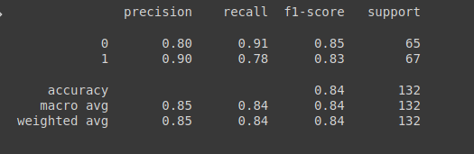
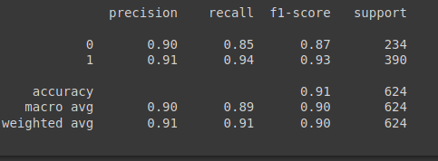
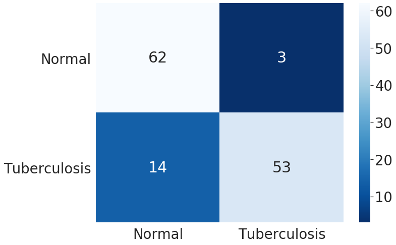
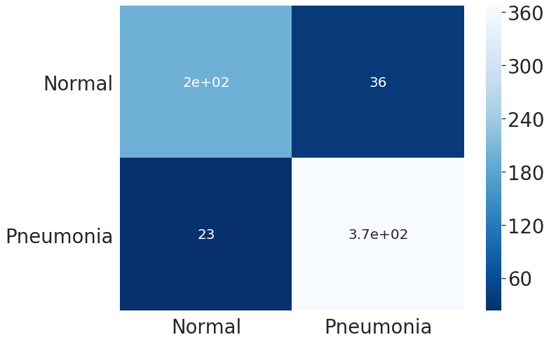
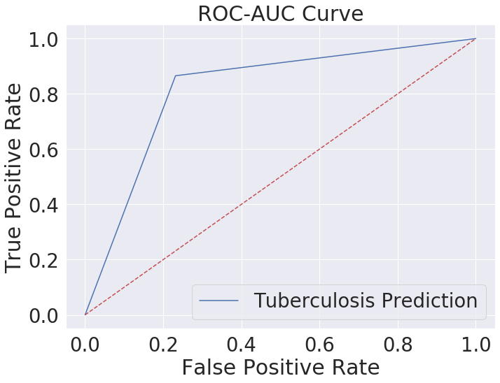
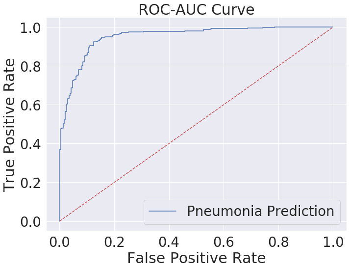

# Pneumonia-and-Tuberculosis-Classification

Pneumonia and Tuberculosis are one of the major causes of deaths among children and the elderly. Furthermore, the fact that despite being curable with proper treatment the numbers of deaths by these diseases are high. In a country with such a large population, the smaller number of doctors is a problem due to which the diagnosis of these diseases is not that accurate and often flawed. In this project, a deep learning model to classify and detect pneumonia and tuberculosis with the help of Convolutional Neural Networks is implemented. The dataset used for Pneumonia consists of chest x-rays of 1 - 5 years of age from Guangzhou women and children’s medical center, Guangzhou, consisting of  5,863  images and for tuberculosis contains 662 chest x-rays. The model detected pneumonia with an accuracy and recall percentage of 91% while the accuracy achieved in detecting tuberculosis is 87% with a recall percentage of 88%.

<h2> Results </h2>

<h3> Classification Report </h3>
 

<h3> Confusion Matrix </h3>
 

<h3> ROC Curve </h3>
 

<h3> For Pneumonia </h3>

<h3> Classification Report </h3>

<h3> Confusion Matrix </h3>

<h3> ROC Curve </h3>

